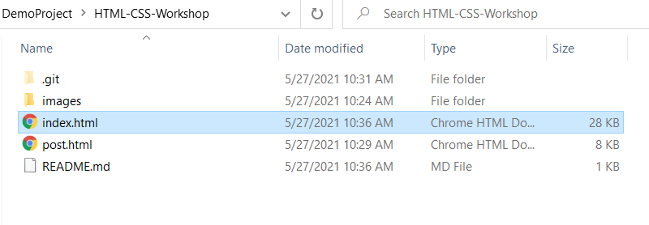
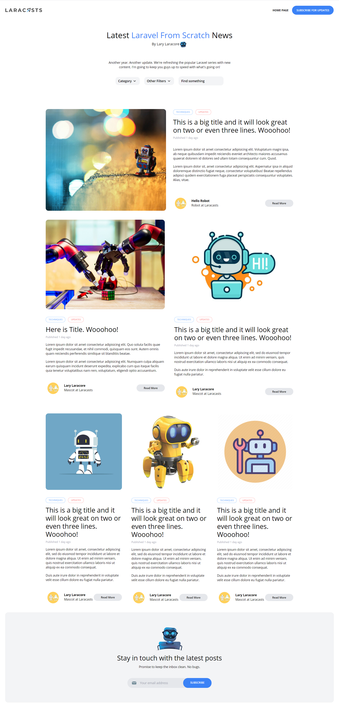

# HTML-CSS-Workshop

### Clone Git Repository 
- git clone https://github.com/NweNweWinThan-X/HTML-CSS-Workshop.git

### Check design
- open index.html on browser

  - double click on index.html and then design will be shown.

